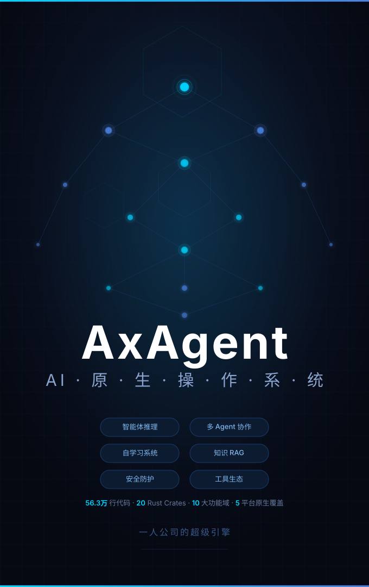

# AxAgent

[](https://github.com/polite0803/AxAgent/releases)
[](https://github.com/polite0803/AxAgent/actions)


<p align="center">
  <a href="./media/poster-axagent.svg">
    
  </a>
</p>

**AxAgent** is an open-source cross-platform AI assistant desktop client supporting **Windows / macOS / Linux / Android / iOS**. It goes beyond a chat interface — integrating a ReAct agent engine, visual workflow orchestration, local RAG knowledge bases, MCP protocol extensions, a unified multi-model gateway, browser automation, and computer control, serving as an AI workstation for daily development, research, knowledge management, and automation.

> **Languages**: [English](./README-EN.md) | [繁體中文](./README-ZH-TW.md) | [日本語](./README-JA.md) | [한국어](./README-KO.md) | [Français](./README-FR.md) | [Deutsch](./README-DE.md) | [Español](./README-ES.md) | [Русский](./README-RU.md) | [हिन्दी](./README-HI.md) | [العربية](./README-AR.md)

---

## What AxAgent Solves

AxAgent addresses three core problems:

1. **Unified Multi-Model Orchestration**: Use OpenAI, Anthropic Claude, Google Gemini, Ollama local models, and any OpenAI-compatible API in a single interface, with multi-key rotation, intelligent model routing, and streaming comparison
2. **AI Capability Operationalization**: Extend AI from "conversation" to "execution" — through 47+ built-in tools, visual workflows, MCP extensions, browser automation, and computer control, enabling AI to directly manipulate files, run code, manage Git, and schedule tasks
3. **Local-First Data Sovereignty**: AI conversations, knowledge bases, memories, and configuration files are all stored in a local SQLite database. API Keys are encrypted with AES-256-GCM. Core functionality runs without any third-party cloud services.

---

## Core Capabilities

### Multi-Model Engine

- **9 Provider Adapters**: OpenAI (Chat Completions + Responses + Realtime), Anthropic Claude, Google Gemini, Ollama (with GGUF management), OpenClaw, Hermes, and all OpenAI-compatible APIs
- **Multi-Key Rotation**: Configure multiple API keys per provider with automatic quota-based rotation to avoid rate-limit interruptions
- **Intelligent Routing**: Automatically select the most suitable model by task type (code review / summarization / translation / general), with customizable routing rules
- **Provider Health Monitoring**: Real-time tracking of success rates, latency, and availability per provider, with tiered automatic fallback (ProviderTier)
- **AI Image Generation**: DALL-E 3 and Flux (Replicate) with multi-size presets
- **Real-Time Voice**: WebSocket voice conversations based on OpenAI Realtime API, supporting interruption and streaming transcription

### Agent System

The entire agent system is built on a **ReAct (Reasoning + Acting) engine**, with the following implemented subsystems:

- **Hierarchical Planner** (`hierarchical_planner`): Decomposes complex tasks into Phase → Task structured plans with dependency relationships, compiled into DAG topological execution
- **Deep Research** (`deep_research`): Multi-source search orchestration including search planning (`search_planner`), search execution (`search_orchestrator`), content synthesis (`content_synthesizer`), and citation tracking (`citation_tracker`)
- **Fact Checker** (`fact_checker`): AI-driven fact verification with source classifier (`source_classifier`), source validator (`source_validator`), and credibility evaluator (`credibility_evaluator`)
- **Tree of Thoughts** (`tree_of_thoughts`): Multi-path reasoning exploration with branch evaluation and backtracking
- **Reflector** (`reflector`): Post-task self-assessment and improvement suggestions
- **Self-Verifier** (`self_verifier`): Automatic validation of reasoning results with cycle detection (`cycle_detector`) to prevent infinite loops
- **Error Recovery** (`error_recovery_engine`): Classify error types → select recovery strategy → auto-retry or adjust plan, with exponential backoff
- **A/B Testing** (`ab_testing`): Comparative evaluation of different reasoning strategies
- **Evaluation System** (`evaluator`): Built-in benchmark framework supporting datasets, metrics, and report generation
- **LoRA Fine-Tuning** (`fine_tune`): Built-in training pipeline with LoRA adapter management
- **RL Optimizer** (`rl_optimizer`): Experience-feedback-based policy reinforcement learning with experience replay and policy gradients
- **Tool Recommender** (`tool_recommender`): Context-based tool usage pattern analysis and recommendations

**Multi-Agent Collaboration**:

- Master-slave coordination architecture (`coordinator`) with parallel sub-agent execution and dependency-aware scheduling
- Shared Blackboard (`shared_blackboard`) for inter-agent information exchange
- Adversarial debate mode with Pro/Con rounds and argument strength scoring
- Swarm cluster mode with multi-process agent clusters supporting permission sync and auto-reconnect
- Proactive mode (`proactive_mode`): Agents can proactively propose suggestions and actions

**Computer Control**: AI-driven mouse clicks, keyboard input, screen scrolling with three-level permissions (Default / Accept Edits / Full Access) and sandbox path isolation

**Browser Automation**: Browser control via CDP protocol supporting navigation, screenshots, clicks, form filling, text extraction, and page state monitoring

### Skill System

- **Skill Marketplace**: Browse and install community skills
- **AI-Assisted Creation**: Auto-create skill structures from natural language proposals
- **Skill Evolution** (`evolution_engine`): Automatically analyze and improve skills based on execution feedback
- **Semantic Matching** (`skill`): Semantically match and auto-recommend relevant skills based on conversation context
- **Skill Decomposition** (`skill_decomposition`): Auto-decompose complex tasks into atomic skill combinations
- **Generated Tools** (`generated_tool`): AI-generated and registered new tools
- **Sandbox Execution** (`sandbox`): Skills execute safely in isolated sandbox environments

### Visual Workflow

Drag-and-drop DAG workflow editor based on ReactFlow 12:

- **17 Node Types**: Trigger, Agent, LLM Call, Conditional Branch, Parallel Fork, Loop, Merge, Delay, Tool Call, Code Execution, Sub-workflow, Vector Retrieval, Document Parsing, Validation, End, Business Rule, Agent Role
- **Kahn Topological Sort Execution**: Automatic cyclic dependency detection with parallel pipeline scheduling
- **Built-in Templates**: Code Review, Bug Fix, Document Generation, Testing, Refactoring, Exploration, Performance Analysis, Security Audit, Feature Development
- **YAML Serialization**: Workflow definitions support YAML import/export
- **Version Management**: Workflow template version control
- **AI Assistance**: AI-assisted workflow design and node recommendations

### Knowledge Management

- **Multi-KB RAG**: Document upload → auto parsing (PDF/DOCX/XLSX/PPTX/TXT) → chunking → vector indexing
- **Hybrid Retrieval**: Vector similarity (sqlite-vec + candle local embeddings) + BM25 full-text search (FTS5) with hybrid ranking
- **Self-RAG**: Self-retrieval-augmented generation with automatic retrieval result reflection and verification
- **Re-ranking**: Cross-encoder result re-ranking for improved precision
- **Knowledge Graph**: Entity extraction (`EntityExtractor`) → relationship construction → visual graph
- **File Watching**: Real-time file change monitoring via `notify` with automatic incremental indexing
- **LLM Wiki**: AI-assisted Wiki compiler and validator with Wiki clipping browser extension

### Memory System

- **Multi-Namespace Memory**: Isolated by project/topic, supporting manual entry and AI auto-extraction
- **Persistence Integration**: Honcho and Mem0 closed-loop memory
- **User Profile** (`user_profile` / `profile`): Auto-learn coding style (indentation/naming/comments), tech stack preferences, and communication style
- **Style Transfer** (`style`): Extract code style features → apply to AI-generated code
- **Dream Integration** (`dream`): Background auto-consolidation of memory fragments and behavioral patterns into structured knowledge
- **Project Memory** (`project_memory`): Per-project contextual persistence

### API Gateway

Built-in HTTP + WebSocket gateway server based on `axum`:

- **Compatible Endpoints**: OpenAI `/v1/chat/completions`, Claude Messages API, Gemini API, plus OpenAI Responses and Realtime WebSocket
- **Key Management**: Generate, revoke, enable/disable access keys with expiration support
- **Usage Tracking**: Per-key, per-provider, per-date request counts and token consumption statistics with Prometheus metrics export
- **Rate Limiting**: Token bucket algorithm via `governor` with configurable rate limit policies
- **SSL/TLS**: Built-in self-signed certificates (`rcgen`) with custom certificate support
- **External Linking**: One-click integration with Claude CLI, OpenCode, and other external tools with auto API key sync
- **Real-Time Tickets**: HMAC-based temporary authentication tickets for secure WebSocket real-time connection handoff

### Messaging Platform Integration

Messaging platform gateway implemented via the `rt-messaging` crate, supporting:

DingTalk, Feishu, QQ, Slack, WeChat, WhatsApp, Telegram, Discord

Supports Webhook message reception, command parsing, and automatic AI reply delivery.

### Tool System

47 built-in tools, all uniformly registered via the `Tool` trait:

| Category         | Tools                                                                                                                                                                                                      |
| ---------------- | ---------------------------------------------------------------------------------------------------------------------------------------------------------------------------------------------------------- |
| File Operations  | `file_read`, `file_write`, `file_edit`, `file_system` (list/search/metadata)                                                                                                                               |
| Code Execution   | `bash`, `repl`                                                                                                                                                                                             |
| Search           | `grep`, `glob`                                                                                                                                                                                             |
| Browser          | `browser` (CDP control)                                                                                                                                                                                    |
| Computer Control | `computer_use` (mouse/keyboard/screenshot)                                                                                                                                                                 |
| Web              | `web_search`, `web_fetch`                                                                                                                                                                                  |
| Knowledge Base   | `knowledge`, `document` (document parsing)                                                                                                                                                                 |
| Git              | `git` (commit/push/branch/diff)                                                                                                                                                                            |
| Dev Tools        | `lsp` (Language Server Protocol), `workspace`                                                                                                                                                              |
| Task Management  | `plan`, `task_system`, `todo_write`, `cron`                                                                                                                                                                |
| Notifications    | `push_notification`, `messaging`                                                                                                                                                                           |
| Database         | `database`                                                                                                                                                                                                 |
| Storage          | `storage`                                                                                                                                                                                                  |
| Other            | `agent`, `agent_memory`, `context`, `export`, `integration`, `media`, `media_delivery`, `migration_tool`, `monitor`, `obsidian`, `ocr`, `personality`, `shared_path`, `system_info`, `testing`, `worktree` |

### MCP Protocol

Complete MCP (Model Context Protocol) implementation based on the `rmcp` crate:

- **Transport Layer**: stdio subprocess + Streamable HTTP + WebSocket
- **OAuth Authentication**: OAuth authorization flow support for MCP servers
- **Tool Discovery**: Auto-discover and register tools exposed by MCP servers
- **MCP Manager**: Server lifecycle management, health checks, auto-reconnect

### Plugin System

OpenClaw-compatible three-tier plugin architecture (Built-in / Bundled / External), supporting:

- npm package installation with built-in marketplace UI for search and install
- Plugin manifest definition, permission declarations, sandbox-isolated execution
- Custom tool registration, Agent providers, Hook interception
- Skill installer: install skills from plugin packages into the skill system

### Security

- **AES-256-GCM Encryption**: Local encrypted storage for API keys and sensitive configuration (`crypto` crate)
- **Prompt Injection Protection**: Four-level defense pipeline (`prompt-guard`) — pattern detection → delimiter escaping → XML wrapper → trust labels, integrated into sessions, prompt construction, Git, and RAG across the full pipeline
- **SSRF Protection** (`ssrf_guard`): URL safety checks blocking requests to internal network addresses
- **Content Filtering** (`content_filter`): Multi-type content safety filtering
- **Rate Limiting** (`rate_limiter`): Token bucket rate limiting for tool calls and API requests
- **Circuit Breaker** (`circuit_breaker`): Automatic circuit-breaking on consecutive failures to protect system stability
- **Access Control** (`tool_access`): Policy-based tool access permission control
- **Sandbox Isolation**: Execution environment isolation for agents and skills

### Developer Experience

- **Distributed Tracing** (`telemetry`): OpenTelemetry integration with Span/Trace visualization
- **Telemetry** (`telemetry`): Structured logging, runtime metrics, performance event collection
- **Replay Debugging**: Agent execution trajectory recording (`trajectory_recorder`) and replay
- **DevTools Panel**: Built-in frontend Trace/Span timeline viewer
- **Benchmark Framework**: Criterion benchmarks (tool_exec / llm_call / search), SWE-bench and Terminal-bench evaluation

### Desktop & Mobile Experience

- **Responsive Layout**: CSS breakpoints adaptive to desktop / tablet / mobile (600px / 900px)
- **11 Languages**: Simplified Chinese, Traditional Chinese, English, Japanese, Korean, French, German, Spanish, Russian, Hindi, Arabic
- **Theme Engine** (`rt-theme`): Dark/Light theme following system preference or manual toggle, deeply customized Ant Design 6
- **Monaco Editor**: Built-in code editor with syntax highlighting, diff preview, multi-language support
- **xterm.js Terminal**: Built-in terminal emulator supporting WebLinks, Unicode 11, search
- **D2 / Mermaid / ECharts**: Architecture diagrams, flowcharts, and interactive chart rendering
- **Session Sharing**: One-click share link generation with configurable access permissions
- **System Tray + Global Hotkeys + Auto-Start**: Non-intrusive background operation
- **Auto-Update**: Automatic GitHub Releases version update detection
- **Proxy Support**: HTTP and SOCKS5 proxy configuration
- **Cloud Workspace**: S3 and WebDAV storage sync with conflict detection and bidirectional sync

### Mobile

- Android APK/AAB (arm64-v8a, armeabi-v7a, x86_64)
- iOS IPA (arm64)
- Mobile-specific adaptations: safe area adaptation, bottom navigation bar, Drawer navigation

---

## Technical Architecture

### Tech Stack

| Layer                | Technology                               |
| -------------------- | ---------------------------------------- |
| Desktop Framework    | Tauri 2.11                               |
| Frontend Framework   | React 19 + TypeScript                    |
| UI Library           | Ant Design 6 + TailwindCSS 4             |
| State Management     | Zustand 5                                |
| Routing              | React Router 7                           |
| Code Editor          | Monaco Editor                            |
| Terminal             | xterm.js 6                               |
| Workflow Editor      | ReactFlow 12                             |
| Charts               | D2 + Mermaid + Recharts + ECharts        |
| Virtual Scrolling    | @tanstack/react-virtual + react-virtuoso |
| Drag & Drop          | @dnd-kit                                 |
| Markdown Rendering   | markstream-react + stream-markdown       |
| Internationalization | i18next + react-i18next                  |
| Build Tool           | Vite 8                                   |
| Testing              | Vitest + Playwright + cargo-nextest      |
| Formatting           | dprint (TS/JSON/Markdown/TOML) + rustfmt |
| Linting              | ESLint + Oxlint + Clippy + cargo-deny    |

### Backend Architecture: Harness Dependency Injection Pattern

The backend uses a Rust workspace architecture with **32 crates**, following the **Harness Architecture Pattern**:

```
All crates are decoupled through trait interfaces defined in axagent-harness.
The runtime (axagent-runtime) assembles and injects dependencies at runtime.

Dependency direction: Concrete implementations → harness ← Callers
```

**harness** is the architectural cornerstone — zero business logic, zero concrete implementations, containing only trait definitions, pure data DTOs, constants, and unified error types. It is depended upon by all other crates and depends on no other axagent-* crate.

```
src-tauri/crates/
├── harness/          # Architectural cornerstone — trait interfaces, DTOs, unified error types, DI contracts
│                     #   200+ trait definitions covering: Agent/Provider/Tool/RAG/Storage/
│                     #   MCP/Plugins/Security/Observability/Memory/Learning/Browser/Messaging
│
├── entities/         # SeaORM entity models
├── dao/              # Data access layer (CRUD)
├── migration/        # Database migrations
│
├── crypto/           # AES-256-GCM encryption/decryption and key management
├── credential/       # Secure credential storage (API keys etc.)
├── storage/          # File storage abstraction (Local / S3 / WebDAV), ZIP read/write support
├── cache/            # Generic caching layer (in-memory)
├── disk-cache/       # Disk-based file caching
├── search/           # Search engine (FTS5 + sqlite-vec + candle embeddings)
├── document-parser/  # Document text extraction (PDF/DOCX/XLSX/PPTX)
├── kit/              # Utility toolkit — path/encoding/hash/date helpers
│
├── runtime-core/     # Runtime common types, config constants
├── runtime/          # Runtime service orchestration — assembles all 30+ crates, the DI runtime container
│                     #   Manages: sessions/terminals/webhooks/rate-limiting/permissions/SSRF/event bus/state
├── rt-workflow/      # Workflow engine — DAG orchestration, node executors, YAML serialization
├── rt-messaging/     # Messaging platform gateway — DingTalk/Feishu/QQ/Slack/WeChat/WhatsApp/Telegram/Discord
├── rt-webhook/       # Generic webhook server and event dispatch
├── rt-dashboard/     # Dashboard plugin framework
├── rt-theme/         # Theme engine — dark/light switching logic
│
├── agent/            # AI agent core — 80+ modules
│                     #   ReAct engine/hierarchical planning/deep research/fact checking/tree of thoughts/
│                     #   reflection/self-verification/error recovery/RL optimization/LoRA fine-tuning/
│                     #   evaluation/tool recommendation/A-B testing/coordinator/blackboard/vision pipeline/
│                     #   web search/academic search/wiki compilation and more
│
├── orchestrator/     # Agent orchestration — multi-agent scheduling, DAG decomposition, dynamic subgraph execution
├── providers/        # Model provider adapters — OpenAI/Anthropic/Gemini/Ollama/
│                     #   OpenClaw/Hermes/Image Generation (DALL-E/Flux)/Realtime/Responses
├── tools/            # Tool system — Tool trait/registry/orchestration/streaming/sandbox/47+ built-in tools
├── gateway/          # API gateway — axum HTTP/WS server, OAuth, rate limiting, Prometheus
├── mcp/              # MCP protocol — stdio + Streamable HTTP, based on rmcp
├── trajectory/       # Learning system — memory/skill evolution/user profile/dream integration
├── plugins/          # Plugin system — OpenClaw compatible, npm package installation, marketplace
├── telemetry/        # Observability — OpenTelemetry, structured logging, runtime metrics
├── prompt-guard/     # Prompt injection protection — L1-L4 multi-level detection pipeline
├── npm/              # npm registry client
└── schema-gen/       # Database schema generation tool
```

### Frontend Architecture

```
src/
├── pages/            # 22 pages
│   ├── ChatPage          # Main chat interface
│   ├── WorkflowPage      # Workflow editor
│   ├── GatewayPage       # API gateway management
│   ├── KnowledgeHubPage  # Knowledge base management
│   ├── MemoryPage        # Memory management
│   ├── SkillsPage        # Skill marketplace
│   ├── SettingsPage      # Settings panel
│   ├── DashboardPage     # Data dashboard
│   ├── TerminalPage      # Terminal
│   ├── FilesPage         # File management
│   ├── GatewayLinkPage   # External link management
│   ├── LinkPage          # Integration links
│   ├── WikiEditorPage    # Wiki editor
│   ├── WikiEditPage      # Wiki editing
│   ├── WikiGraphPage     # Wiki knowledge graph
│   ├── FineTunePage      # LoRA fine-tuning
│   ├── PersonaPage       # Persona management
│   ├── QuickBarPage      # Quick bar
│   ├── IngestPage        # Document ingestion
│   ├── WorkflowMarketplace # Workflow marketplace
│   ├── DynamicUIManagerPage # Dynamic UI management
│   └── DynamicPageViewer    # Dynamic page viewer
│
├── components/       # 24 modules, 200+ components
│   ├── chat/         # Chat UI (message stream/input/attachments/tool calls/artifacts/thinking blocks)
│   ├── workflow/     # Workflow editor (nodes/edges/panels/templates/AI assistance)
│   ├── gateway/      # API gateway management UI
│   ├── settings/     # Settings panel (40+ sub-components)
│   ├── skill/        # Skill editor and renderer
│   ├── benchmark/    # Benchmark panel
│   ├── decomposition/# Skill decomposition and tool generation
│   ├── devtools/     # Trace/Span timeline
│   ├── layout/       # Layout (title bar/sidebar/command palette)
│   └── ...
│
├── stores/           # 62 Zustand stores
│   ├── domain/       # Core business state
│   ├── feature/      # Feature module state (44)
│   └── devtools/     # DevTools state
│
├── hooks/            # React Hooks
├── lib/              # Utility functions + Web Workers
├── types/            # TypeScript type definitions
├── sdk/              # External integration SDK
└── i18n/             # 11 language translations (zh-CN/zh-TW/en-US/ja/ko/fr/de/es/ru/hi/ar)
```

---

## Data Directory

```
~/.axagent/                    # Application configuration
├── axagent.db                 # SQLite main database (SeaORM)
├── master.key                 # AES-256 master key
├── vector_db/                 # sqlite-vec vector index
└── ssl/                       # Self-signed SSL certificates

~/Documents/axagent/          # User files
├── images/                   # Image attachments
├── files/                    # File attachments
└── backups/                  # Auto backups
```

---

## Quick Start

### Requirements

- [Node.js](https://nodejs.org/) 20+
- [Rust](https://www.rust-lang.org/) 1.75+, edition 2024
- [npm](https://www.npmjs.com/) 10+
- Windows: [Visual Studio Build Tools](https://visualstudio.microsoft.com/visual-cpp-build-tools/) (MSVC + Windows SDK)
- macOS: Xcode Command Line Tools
- Linux: `build-essential` + `libwebkit2gtk-4.1-dev` + `libssl-dev`

### Build

```bash
git clone https://github.com/polite0803/AxAgent.git
cd AxAgent
npm install
npm run tauri dev      # Development mode
npm run tauri build    # Production build
```

Build artifacts are located at `src-tauri/target/release/`.

### Testing

```bash
npm run test           # Frontend unit tests (Vitest watch)
npm run test:run       # Frontend unit tests (single run)
npm run test:e2e       # E2E tests (Playwright)

# Rust backend tests
cd src-tauri && cargo nextest run
cd src-tauri && cargo test

# Type checking & Linting
npm run typecheck
cd src-tauri && cargo clippy -- -D warnings
npm run format

# CI full check
npm run ci:check
```

---

## Platform Support

| Platform | Architecture                              |
| -------- | ----------------------------------------- |
| Windows  | x86_64, ARM64                             |
| macOS    | Apple Silicon (arm64), Intel (x86_64)     |
| Linux    | x86_64, ARM64                             |
| Android  | arm64-v8a, armeabi-v7a, x86_64 (emulator) |
| iOS      | arm64                                     |

---

## License

This project is open-sourced under the [AGPL-3.0-only](LICENSE) license.

---

## Acknowledgments

AxAgent is built upon many outstanding open-source projects, including but not limited to:

- [Tauri](https://tauri.app/) — Cross-platform desktop framework
- [React](https://react.dev/) + [Ant Design](https://ant.design/) — Frontend UI
- [SeaORM](https://www.sea-ql.org/SeaORM/) — Rust ORM
- [sqlite-vec](https://github.com/asg017/sqlite-vec) — Vector search
- [candle](https://github.com/huggingface/candle) — Local embedding inference
- [rmcp](https://github.com/nicholasxjy/rmcp) — Rust MCP SDK
- [ReactFlow](https://reactflow.dev/) — Visual workflow editor
- [axum](https://github.com/tokio-rs/axum) — HTTP framework
- [Monaco Editor](https://microsoft.github.io/monaco-editor/) — Code editor
- [xterm.js](https://xtermjs.org/) — Terminal emulator
