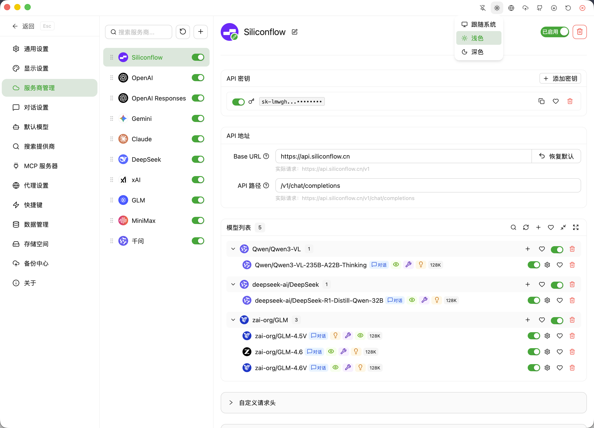
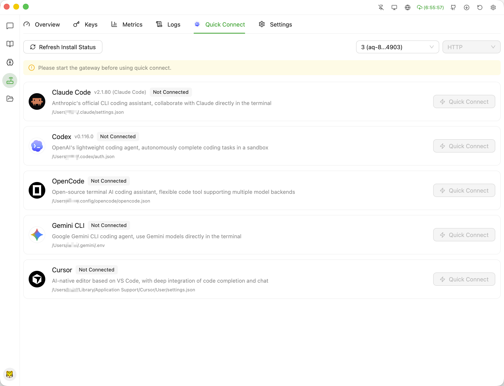
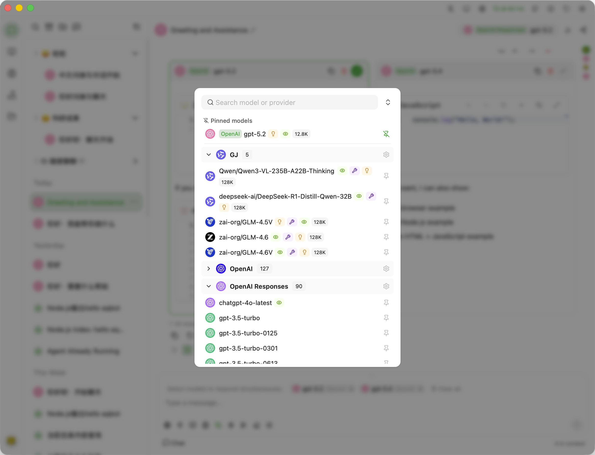
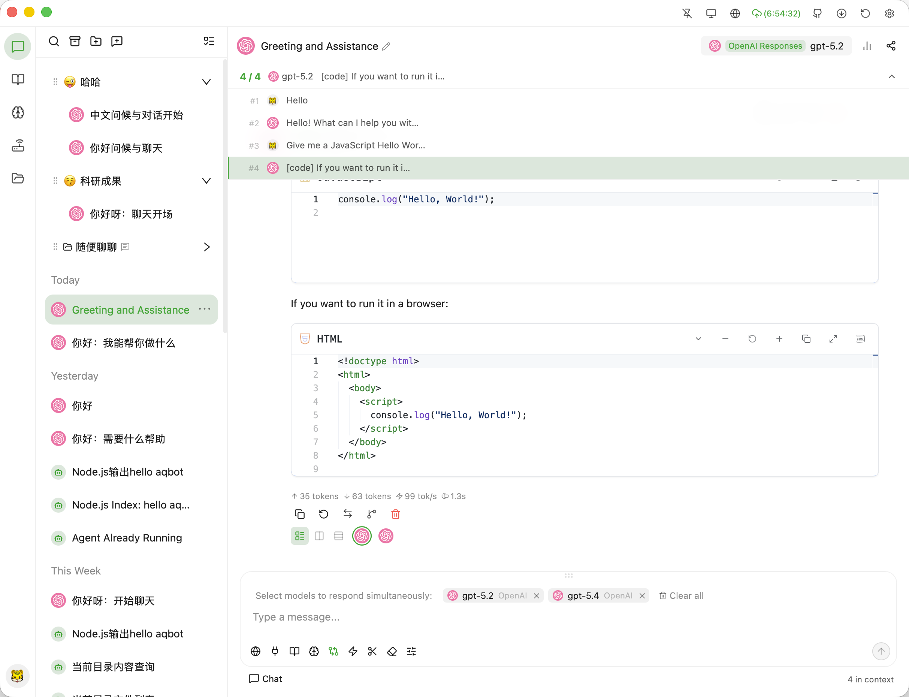

[简体中文](./README.md) | [繁體中文](./README-ZH-TW.md) | [English](./README-EN.md) | [日本語](./README-JA.md) | **한국어** | [Français](./README-FR.md) | [Deutsch](./README-DE.md) | [Español](./README-ES.md) | [Русский](./README-RU.md) | [हिन्दी](./README-HI.md) | [العربية](./README-AR.md)

[](https://github.com/polite0803/AxAgent)

<p align="center">
    <a href="https://www.producthunt.com/products/axagent?embed=true&amp;utm_source=badge-featured&amp;utm_medium=badge&amp;utm_campaign=badge-axagent" target="_blank" rel="noopener noreferrer"></a>
</p>

## 스크린샷

| 대화 차트 렌더링 | 서비스 제공업체 및 모델 |
|:---:|:---:|
|  |  |

| 지식 베이스 | 메모리 |
|:---:|:---:|
|  |  |

| Agent - 질문 | API 게이트웨이 원클릭 접속 |
|:---:|:---:|
|  |  |

| 대화 모델 선택 | 대화 탐색 |
|:---:|:---:|
|  |  |

| Agent - 권한 승인 | API 게이트웨이 개요 |
|:---:|:---:|
|  |  |

## 기능 목록

### 채팅 및 모델

- **멀티 프로바이더 지원** — OpenAI, Anthropic Claude, Google Gemini 및 모든 OpenAI 호환 API와 호환; Ollama 로컬 모델, OpenClaw/Hermes 원격 게이트웨이 연결도 지원
- **모델 관리** — 원격 모델 목록 가져오기, 파라미터 사용자 정의 (온도, 최대 토큰, Top-P 등)
- **멀티 키 로테이션** — 프로바이더별로 여러 API 키를 구성하여 속도 제한 부담을 분산하도록 자동 로테이션
- **스트리밍 출력** — 토큰 단위 실시간 렌더링, thinking 블록 접기/펼치기
- **메시지 버전** — 메시지당 여러 응답 버전을 전환하여 모델 또는 파라미터 효과 비교
- **대화 브랜치** — 임의의 메시지 노드에서 새 브랜치를 생성하고, 브랜치 간 나란히 비교
- **대화 관리** — 고정, 보관, 시간대별 표시, 일괄 작업
- **대화 압축** — 긴 대화를 자동으로 압축하여 핵심 정보를 보존하고 컨텍스트 공간 절약
- **멀티모델 동시 응답** — 동일한 질문을 여러 모델에 동시에 보내고 답변 나란히 비교
- **카테고리 시스템** — 주제 기반 구성을 지원하는 사용자 정의 대화 카테고리

### AI Agent

- **Agent 모드** — Agent 모드로 전환하여 자율적인 다단계 작업 수행: 파일 읽기/쓰기, 명령어 실행, 코드 분석 등
- **3단계 권한** — 기본 (쓰기에 승인 필요), 편집 수락 (파일 변경 자동 승인), 전체 액세스 (프롬프트 없음) — 안전하고 제어 가능
- **작업 디렉토리 샌드박스** — Agent 작업은 지정된 작업 디렉토리로 엄격히 제한되어 무단 접근 방지
- **도구 승인 패널** — 도구 호출 요청의 실시간 표시, 개별 검토, 원클릭 "항상 허용" 또는 거부
- **비용 추적** — 세션별 실시간 토큰 사용량 및 비용 통계
- **일시 중지/재개** — 언제든지 Agent 작업을 일시 중지하고 검토 후 재개 가능
- **Bash 명령어 실행** — 샌드박스 환경에서 Shell 명령어 실행, 자동 위험 검증

### 멀티 에이전트 시스템

- **서브 Agent 조정** — 마스터-슬레이브 조정 아키텍처로 여러 서브 Agent 생성
- **병렬 실행** — 복잡한 작업의 효율성을 높이기 위해 여러 Agent 병렬 처리
- **대립 토론** — 여러 Agent가 서로 다른 관점으로 토론하여 아이디어 충돌을 통해 더 나은 솔루션 생산
- **워크플로 엔진** — 조건 분기, 루프, 병렬 실행을 지원하는 강력한 워크플로 오케스트레이션
- **팀 역할** — 다양한 Agent에 특정 역할(코드 리뷰, 테스트, 문서 등) 할당하여 협력적으로 작업 완료

### 스킬 시스템

- **스킬 마켓플레이스** — 커뮤니티가 기여한 스킬을 검색하고 설치할 수 있는 내장 마켓플레이스
- **스킬 생성** — 제안에서 자동으로 스킬 생성, Markdown 편집기 지원
- **스킬 진화** — AI가 기존 스킬을 자동으로 분석하고 개선하여 실행 효과 향상
- **스킬 매칭** — 적절한 대화 시나리오에 자동으로 관련 스킬 추천
- **로컬 스킬 레지스트리** — 사용자 정의 로컬 도구를 재사용 가능한 스킬로 등록
- **플러그인 훅** — 스킬 실행 전후에 사용자 정의 로직을 주입하는 pre/post 훅 지원

### 콘텐츠 렌더링

- **Markdown 렌더링** — 코드 강조, LaTeX 수식, 표, 작업 목록 완전 지원
- **Monaco 코드 에디터** — 코드 블록에 Monaco Editor 내장, 구문 강조·복사·diff 미리보기 지원
- **다이어그램 렌더링** — Mermaid 플로우차트 및 D2 아키텍처 다이어그램 렌더링 내장
- **Artifact 패널** — 코드 스니펫, HTML 초안, Markdown 노트, 보고서를 전용 패널에서 미리보기
- **세션 인스펙터** — 빠른 탐색을 위해 세션 구조를 트리 보기로 실시간 표시

### 검색 및 지식

- **웹 검색** — Tavily, Zhipu WebSearch, Bocha 등과 통합, 인용 출처 주석 포함
- **로컬 지식 베이스(RAG)** — 여러 지식 베이스 지원, 문서 업로드 시 자동 파싱·청킹·벡터 인덱싱, 대화 중 의미 검색
- **지식 그래프** — 지식 포인트 간의 연결을 시각화하는 지식 엔티티 관계 그래프
- **메모리 시스템** — 다중 네임스페이스 메모리, 수동 입력 또는 AI 자동 핵심 정보 추출
- **전체 텍스트 검색** — FTS5 엔진으로 대화, 파일, 메모리의 빠른 검색 지원
- **컨텍스트 관리** — 파일 첨부, 검색 결과, 지식 베이스 단락, 메모리 항목, 도구 출력을 유연하게 첨부

### 도구 및 확장

- **MCP 프로토콜** — stdio 및 HTTP/WebSocket 전송을 모두 지원하는 완전한 Model Context Protocol 구현
- **OAuth 인증** — MCP 서버 OAuth 인증 흐름 지원
- **내장 도구** — 파일 작업, 코드 실행, 검색 등의 즉시 사용 가능한 내장 도구 제공
- **도구 실행 패널** — 도구 호출 요청 및 반환 결과를 시각적으로 표시
- **LSP 클라이언트** — 스마트 코드 완성 및 진단을 위한 내장 LSP 프로토콜 지원

### API 게이트웨이

- **로컬 API 게이트웨이** — OpenAI 호환, Claude, Gemini 인터페이스를 네이티브 지원하는 내장 로컬 API 서버
- **외부 링크** — Claude CLI, OpenCode 등의 외부 도구에 원클릭 통합, API 키 자동 동기화
- **API 키 관리** — 액세스 키 생성, 취소, 활성화/비활성화, 설명 메모 지원
- **사용량 분석** — 키, 프로바이더, 날짜별 요청 수 및 토큰 사용량 분석
- **진단 도구** — 게이트웨이 상태 확인, 연결 테스트, 요청 디버깅
- **SSL/TLS 지원** — 자체 서명 인증서 생성 내장, 사용자 정의 인증서 지원
- **요청 로그** — 게이트웨이를 통과하는 모든 API 요청 및 응답의 완전한 기록
- **설정 템플릿** — Claude, Codex, OpenCode, Gemini 등 인기 CLI 도구를 위한 통합 템플릿 사전 설정
- **실시간 통신** — WebSocket 실시간 이벤트 푸시, OpenAI Realtime API 호환

### 데이터 및 보안

- **AES-256 암호화** — API 키 등 민감한 데이터는 AES-256-GCM으로 로컬에 암호화
- **데이터 디렉터리 격리** — 앱 상태는 `~/.axagent/`, 사용자 파일은 `~/Documents/axagent/`에 저장
- **자동 백업** — 로컬 디렉터리 또는 WebDAV 저장소로의 예약 자동 백업
- **백업 복원** — 이전 백업에서 원클릭으로 완전 복원
- **대화 내보내기** — PNG 스크린샷, Markdown, 일반 텍스트, JSON 형식으로 대화 내보내기
- **스토리지 공간 관리** — 디스크 사용량의 시각적 표시와 불필요한 파일 정리

### 데스크톱 경험

- **테마 전환** — 시스템 설정을 따르거나 수동으로 설정 가능한 다크/라이트 테마
- **인터페이스 언어** — 간체 중국어, 번체 중국어, 영어, 일본어, 한국어, 프랑스어, 독일어, 스페인어, 러시아어, 힌디어, 아랍어 완전 지원
- **시스템 트레이** — 창 닫기 시 시스템 트레이로 최소화, 백그라운드 서비스 중단 없음
- **항상 위에 표시** — 메인 창을 모든 다른 창 위에 고정
- **글로벌 단축키** — 언제든지 메인 창을 불러오는 사용자 정의 글로벌 키보드 단축키
- **자동 시작** — 시스템 시작 시 자동 실행 선택 가능
- **프록시 지원** — HTTP 및 SOCKS5 프록시 설정
- **자동 업데이트** — 시작 시 새 버전을 자동으로 확인하고 업데이트 안내
- **명령 팔레트** — `Cmd/Ctrl+K`로 모든 명령 및 설정에 빠르게 액세스

## 플랫폼 지원

| 플랫폼 | 아키텍처 |
|--------|---------|
| macOS | Apple Silicon (arm64), Intel (x86_64) |
| Windows 10/11 | x86_64, arm64 |
| Linux | x86_64 (AppImage/deb/rpm), arm64 (AppImage/deb/rpm) |

## 시작하기

[Releases](https://github.com/polite0803/AxAgent/releases) 페이지로 이동하여 플랫폼에 맞는 설치 프로그램을 다운로드하세요.

## 소스から 빌드

### 전제 조건

- [Node.js](https://nodejs.org/) 20+
- [Rust](https://www.rust-lang.org/) 1.75+
- [npm](https://www.npmjs.com/) 10+
- Windows에서는 [Visual Studio Build Tools](https://visualstudio.microsoft.com/visual-cpp-build-tools/)와 [Rust MSVC targets](https://doc.rust-lang.org/cargo/reference/config.html#cfgtarget)가 필요합니다

### 빌드 단계

```bash
# 저장소를 클론합니다
git clone https://github.com/polite0803/AxAgent.git
cd AxAgent

# 의존성을 설치합니다
npm install

# 개발 모드로 실행합니다
npm run tauri dev

# 프론트엔드만 빌드합니다
npm run build

# 데스크톱 애플리케이션을 빌드합니다
npm run tauri build
```

빌드 산출물은 `src-tauri/target/release/` 디렉토리에 있습니다.

### 테스트

```bash
# 단위 테스트 실행
npm test

# E2E 테스트 실행
npm run test:e2e

# 타입 검사
npm run typecheck
```

## 자주 묻는 질문

### macOS: "앱이 손상되었습니다" 또는 "개발자를 확인할 수 없습니다"

애플리케이션이 Apple에 의해 서명되지 않았기 때문에 macOS에서 다음 중 하나의 메시지가 표시될 수 있습니다:

- "AxAgent"이 손상되어 열 수 없습니다
- Apple에서 악성 소프트웨어를 확인할 수 없어 "AxAgent"을 열 수 없습니다

**해결 단계:**

**1. "모든 곳"에서 앱 허용**

```bash
sudo spctl --master-disable
```

그런 다음 **시스템 설정 → 개인 정보 보호 및 보안 → 보안**으로 이동하여 **모든 곳**을 선택하세요.

**2. 격리 속성 제거**

```bash
sudo xattr -dr com.apple.quarantine /Applications/AxAgent.app
```

> 팁: 터미널에 `sudo xattr -dr com.apple.quarantine `을 입력한 후 앱 아이콘을 드래그할 수 있습니다.

**3. macOS Ventura 이상의 추가 단계**

위 단계를 완료한 후에도 첫 번째 실행이 차단될 수 있습니다. **시스템 설정 → 개인 정보 보호 및 보안**으로 이동하여 보안 섹션에서 **그래도 열기**를 클릭하세요. 이 작업은 한 번만 필요합니다.

## 커뮤니티
- [LinuxDO](https://linux.do)

## 라이선스

이 프로젝트는 [AGPL-3.0](LICENSE) 라이선스에 따라 배포됩니다.