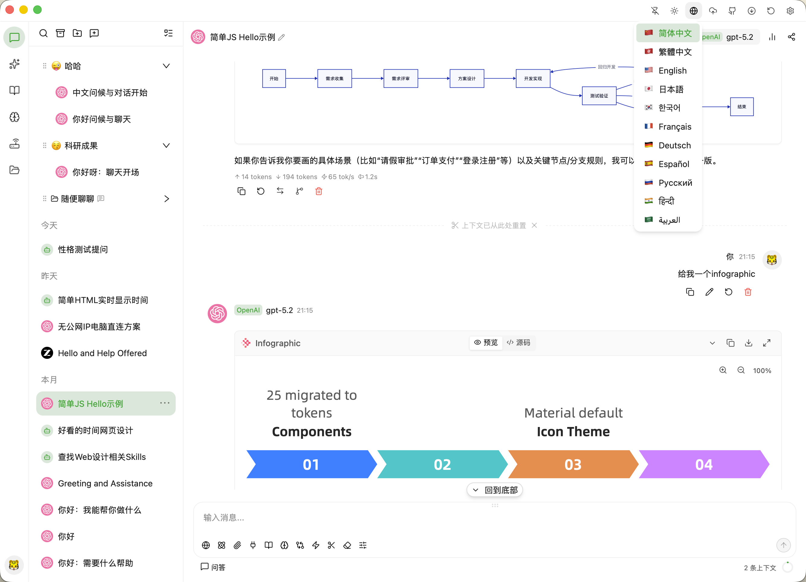
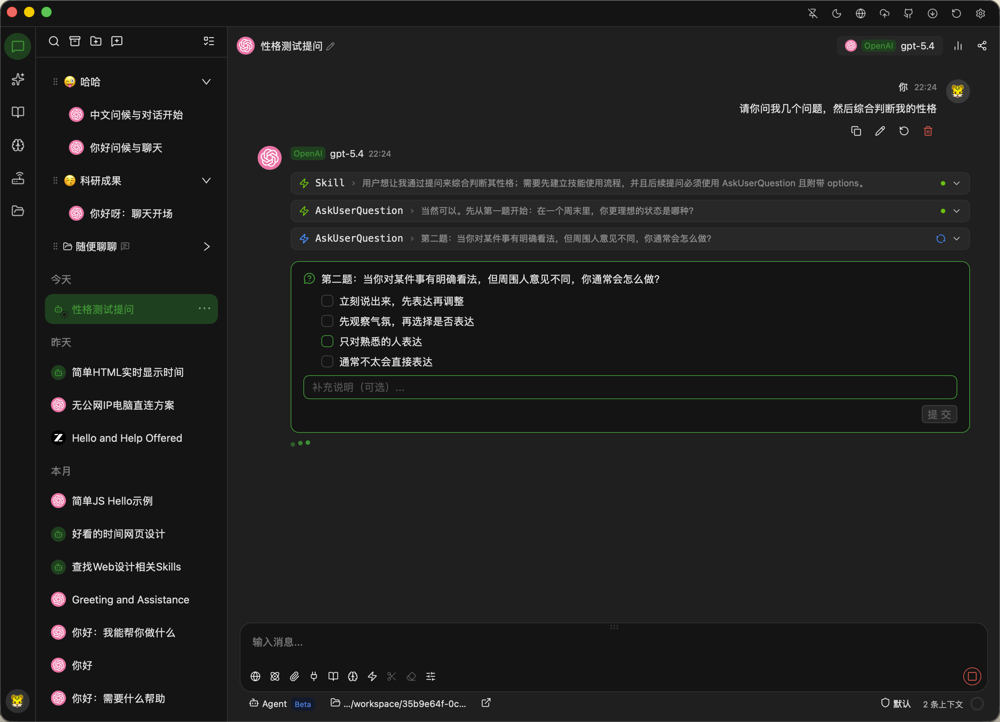
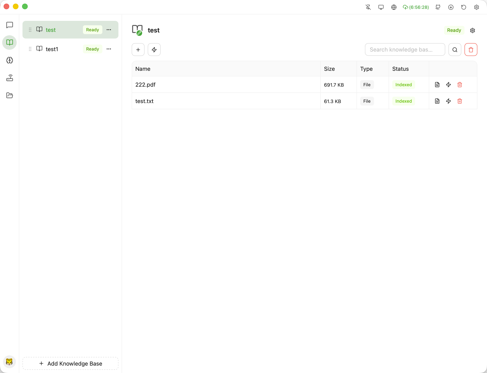
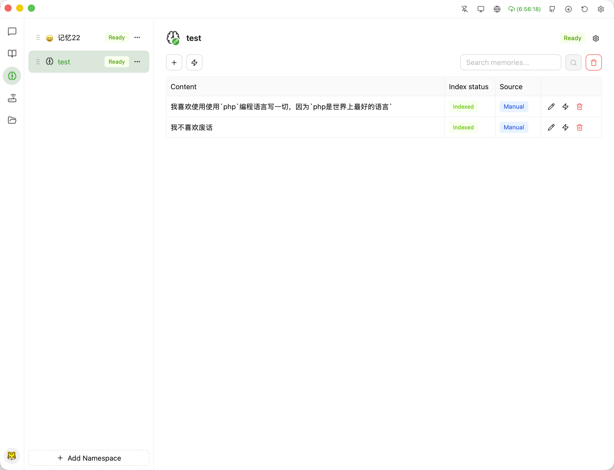
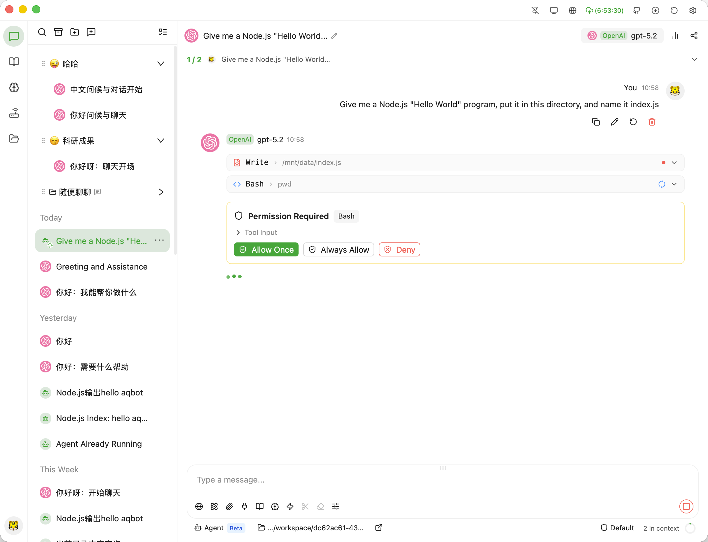
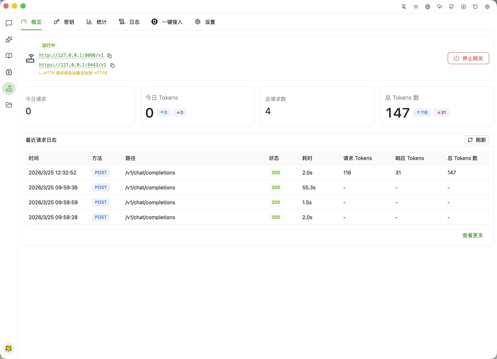

[**English**](./README-EN.md) | [简体中文](./README.md) | **繁體中文** | [日本語](./README-JA.md) | [한국어](./README-KO.md) | [Français](./README-FR.md) | [Deutsch](./README-DE.md) | [Español](./README-ES.md) | [Русский](./README-RU.md) | [हिन्दी](./README-HI.md) | [العربية](./README-AR.md)

[](https://github.com/polite0803/AxAgent)

<p align="center">
  <a href="https://www.producthunt.com/products/axagent?embed=true&amp&amp&utm_source=badge-featured&amp&amp;&amp;#10;&amp;amp&amp&amp;;utm_medium=badge&amp&amp;#10&amp&amp;;utm_campaign=badge-axagent" target="_blank" rel="noopener noreferrer"></a>
</p>

<p align="center">
  <strong>跨平台 AI 桌面客戶端 | 多智能體協作 | 本地優先</strong>
</p>

<p align="center">
  <a href="https://github.com/polite0803/AxAgent/releases" target="_blank">
    
  </a>
  <a href="https://github.com/polite0803/AxAgent/actions" target="_blank">
    
  </a>
  
  
</p>

---

## 什麼是 AxAgent？

AxAgent 是一款功能全面的跨平台 AI 桌面應用，整合了先進的 AI 智能體能力和豐富的開發者工具。它支援多模型提供商、自主管道執行、可視化工作流編排、本地知識管理以及內建 API 網關。

---

## 截圖預覽

| 對話與模型選擇 | 多智能體儀表盤 |
|:---:|:---:|
|  |  |

| 知識庫 RAG | 記憶與上下文 |
|:---:|:---:|
|  |  |

| 工作流編輯器 | API 閘道 |
|:---:|:---:|
|  |  |

---

## 核心功能

### 🤖 AI 模型支援

- **多提供商支援** — 原生整合 OpenAI、Anthropic Claude、Google Gemini、Ollama、OpenClaw、Hermes 及所有 OpenAI 相容 API
- **多 Key 輪換** — 為每個提供商配置多個 API Key，自動輪換分發限流
- **本地模型支援** — 完整支援 Ollama 本地模型，包含 GGUF/GGML 檔案管理
- **模型管理** — 遠端模型列表獲取，可自訂參數（temperature、max tokens、top-p 等）
- **串流輸出** — 即時逐 Token 渲染，支援可折疊的思考塊（Claude 擴展思考）
- **多模型對比** — 同時向多個模型提問，side-by-side 對比結果
- **函數呼叫** — 跨所有支援提供商的結構化函數呼叫

### 🔐 AI 智能體系統

智能體系統基於精密架構構建，具備以下特性：

- **ReAct 推理引擎** — 融合推理與行動，內建自驗證確保任務執行可靠
- **層級規劃器** — 將複雜任務分解為具有階段和依賴關係的結構化計劃
- **工具註冊表** — 動態工具註冊，支援語義版本控制和衝突檢測
- **計算機控制** — AI 控制的滑鼠點擊、鍵盤輸入、螢幕滾動，配合視覺模型分析
- **螢幕感知** — 截圖擷取和視覺模型分析，用於 UI 元素識別
- **三級許可權模式** — 預設（需要審批）、接受編輯（自動批准）、完全訪問（無提示）
- **沙箱隔離** — 智能體操作嚴格限制在指定工作目錄內
- **工具審批面板** — 即時顯示工具呼叫請求，支援逐條審批
- **成本追蹤** — 即時顯示每個對話的 token 使用量和成本統計
- **暫停/恢復** — 隨時暫停智能體執行，稍後恢復
- **檢查點系統** — 持久化檢查點用於崩潰恢復和對話重連
- **錯誤恢復引擎** — 自動錯誤分類和恢復策略執行

### 👥 多智能體協作

- **子智能體協調** — 主從架構，支援多個協作智能體
- **並行執行** — 多個智能體並行處理任務，支援依賴感知調度
- **對抗性辯論** — Pro/Con 辯論輪次，支援論點強度評分和反駁追蹤
- **智能體角色** — 預定義角色（研究員、規劃師、開發者、評審員、綜合員）用於團隊協作
- **智能體編排器** — 多智能體團隊的中心化消息路由和狀態管理
- **通訊圖譜** — 智能體互動和消息流的可視化展示

### ⭐ 技能系統

- **技能市場** — 內建市場，瀏覽和安裝社群貢獻的技能
- **技能創建** — 從提案自動建立技能，支援 Markdown 編輯器
- **技能進化** — 基於執行回饋的 AI 驅動的現有技能自動分析和改進
- **技能匹配** — 語義匹配，推薦與對話上下文相關的技能
- **原子技能** — 可組合成複雜工作流的細粒度技能元件
- **技能分解** — 自動將複雜任務分解為可執行的原子技能
- **生成工具** — AI 自動產生並註冊新工具，擴展智能體能力
- **技能中心** — 集中的技能發現和配置管理介面
- **技能中心用戶端** — 與遠端技能中心整合，支援社群分享

### 🔄 工作流系統

工作流引擎實現了基於 DAG 的任務編排系統：

- **可視化工作流編輯器** — 拖放式工作流設計器，支援節點連接和配置
- **豐富節點類型** — 14 種節點類型：觸發器、智能體、LLM、條件、並行、循環、合併、延遲、工具、代碼、原子技能、向量檢索、文檔解析、驗證
- **工作流模板** — 內建預設：代碼審查、Bug 修復、文檔、測試、重構、探索效能、安全、功能開發
- **DAG 執行** — Kahn 演算法拓撲排序，支援循環檢測
- **並行調度** — 流水線式執行，快速步驟不等慢速步驟
- **重試策略** — 指數退避，每步可配置最大重試次數
- **部分完成** — 失敗的步驟不會阻塞獨立的下游步驟
- **版本管理** — 工作流模板版本控制，支援回滾
- **執行歷史** — 詳細記錄，支援狀態追蹤和調試
- **AI 輔助** — AI 輔助工作流設計和優化

### 📚 知識與記憶

- **知識庫（RAG）** — 多知識庫支援，支援文檔上傳、自動解析、分塊和向量索引
- **混合搜索** — 結合向量相似度搜索與 BM25 全文排名
- **重排序** — Cross-encoder 重排序，提升檢索精度
- **知識圖譜** — 知識關聯的實體關係可視化
- **記憶系統** — 多命名空間記憶，支援手動錄入或 AI 自動提取
- **閉環記憶** — 整合 Honcho 和 Mem0 持久化記憶提供商
- **FTS5 全文搜索** — 跨對話、檔、記憶的快速檢索
- **對話搜索** — 跨所有對話對話的高級搜索
- **上下文管理** — 靈活附加檔、搜索結果、知識片段、記憶、工具輸出

### 🌐 API 網關

- **本地 API 伺服器** — 內建 OpenAI 相容、Claude 和 Gemini 介面伺服器
- **外部連結** — 一鍵整合 Claude CLI、OpenCode，自動同步 API Key
- **Key 管理** — 產生、撤銷、啟用/停用存取 Key，支援描述
- **用量分析** — 按 Key、提供商、日期的請求量和 token 使用量
- **SSL/TLS 支援** — 內建自簽名憑證，支援自訂憑證
- **請求日誌** — 完整記錄所有 API 請求和回應
- **配置模板** — Claude、Codex、OpenCode、Gemini 的預建模板
- **即時 API** — 相容 OpenAI 即時 API 的 WebSocket 事件推送
- **平台整合** — 支援釘釘、飛書、QQ、Slack、微信、WhatsApp

### 🔧 工具與擴展

- **MCP 協定** — 完整的模型上下文協定實現，支援 stdio 和 HTTP/WebSocket 傳輸
- **OAuth 認證** — MCP 伺服器的 OAuth 流程支援
- **內建工具** — 全面的檔操作、程式碼執行、搜索等工具集
- **LSP 用戶端** — 內建語言伺服器協定，支援程式碼補全和診斷
- **終端後端** — 支援本地、Docker 和 SSH 終端連接
- **瀏覽器自動化** — 通過 CDP 整合瀏覽器控制能力
- **UI 自動化** — 跨平台 UI 元素識別和控制
- **Git 工具** — Git 操作，支援分支檢測和衝突感知

### 📊 內容渲染

- **Markdown 渲染** — 完整支援代碼高亮、LaTeX 數學公式、表格、任務列表
- **Monaco 程式碼編輯器** — 內建編輯器，支援語法高亮、複製、差異預覽
- **圖表渲染** — Mermaid 流程圖、D2 架構圖、ECharts 互動式圖表
- **產物面板** — 程式碼片段、HTML 草稿、React 元件、Markdown 筆記，支援即時預覽
- **三種預覽模式** — 代碼（編輯器）、分屏（並排）、預覽（僅渲染）
- **對話檢查器** — 對話結構的樹形視圖，快速導航
- **引用面板** — 追蹤和顯示來源引用，支援可信度評分

### 🛡️ 資料與安全

- **AES-256 加密** — API Key 和敏感資料使用 AES-256-GCM 加密
- **隔離存儲** — 應用狀態存儲在 `~/.axagent/`，用戶檔存儲在 `~/Documents/axagent/`
- **自動備份** — 計畫備份到本地目錄或 WebDAV 存儲
- **備份恢復** — 一鍵從歷史備份恢復
- **匯出選項** — PNG 截圖、Markdown、純文字、JSON 格式
- **存儲管理** — 可視化磁碟使用顯示和清理工具

### 🖥️ 桌面體驗

- **主題引擎** — 深色/淺色主題，支援跟隨系統或手動偏好
- **介面語言** — 12 種語言：簡體中文、繁體中文、英語、日語、韓語、法語、德語、西班牙語、俄語、印地語、阿拉伯語
- **系統匣** — 最小化到系統匣，不中斷後台服務
- **置頂視窗** — 視窗置頂於其他視窗之上
- **全域快捷鍵** — 可自訂快捷鍵叫出主視窗
- **開機自啟** — 可選在系統啟動時執行
- **代理支援** — HTTP 和 SOCKS5 代理配置
- **自動更新** — 自動檢查版本，有更新時提示
- **命令面板** — `Cmd/Ctrl+K` 快速存取命令

### 🔬 高級功能

- **Cron 調度器** — 自動化任務調度，支援每日/每週/每月模板和自訂 cron 表達式
- **Webhook 系統** — 事件訂閱，支援工具完成、智能體錯誤、對話結束通知
- **用戶畫像** — 自動學習程式碼風格、命名規範、縮排、註釋風格、溝通偏好
- **RL 優化器** — 強化學習優化工具選擇和任務策略
- **LoRA 微調** — 使用 LoRA 進行本地訓練的自訂模型適配
- **主動建議** — 基於對話內容和使用戶模式的上下文感知提示
- **思維鏈** — 智能體決策推理的可視化，逐步分解
- **錯誤恢復** — 自動錯誤分類、根因分析和恢復建議
- **開發者工具** — Trace、Span、時間線可視化，用於調試和效能分析
- **基準測試系統** — 任務效能評估和指標，帶評分卡
- **風格遷移** — 將學習的程式碼風格偏好套用到生成的程式碼
- **儀表盤插件** — 可擴展的儀表盤，支援自訂面板和小工具

---

## 技術架構

### 技術堆疊

| 層級 | 技術 |
|------|------|
| **框架** | Tauri 2 + React 19 + TypeScript |
| **UI** | Ant Design 6 + TailwindCSS 4 |
| **狀態管理** | Zustand 5 |
| **國際化** | i18next + react-i18next |
| **後端** | Rust + SeaORM + SQLite |
| **向量資料庫** | sqlite-vec |
| **程式碼編輯器** | Monaco Editor |
| **圖表** | Mermaid + D2 + ECharts |
| **終端** | xterm.js |
| **構建** | Vite + npm |

### Rust 後端架構

後端組織為 Rust workspace，包含專業化的 crates：

```
src-tauri/crates/
├── agent/         # AI 智能體核心
│   ├── react_engine.rs       # ReAct 推理引擎
│   ├── tool_registry.rs      # 動態工具註冊
│   ├── coordinator.rs        # 智能體協調
│   ├── hierarchical_planner.rs # 任務分解
│   ├── self_verifier.rs      # 輸出驗證
│   ├── error_recovery_engine.rs # 錯誤處理
│   ├── vision_pipeline.rs    # 螢幕感知
│   └── fine_tune/            # LoRA 微調
│
├── core/          # 核心工具
│   ├── db.rs               # SeaORM 資料庫
│   ├── vector_store.rs     # sqlite-vec 整合
│   ├── rag.rs             # RAG 抽象層
│   ├── hybrid_search.rs    # 向量 + FTS5 搜索
│   ├── crypto.rs           # AES-256 加密
│   └── mcp_client.rs       # MCP 協定用戶端
│
├── gateway/       # API 網關
│   ├── server.rs          # HTTP 伺服器
│   ├── handlers.rs         # API 處理器
│   ├── auth.rs            # 認證
│   └── realtime.rs        # WebSocket 支援
│
├── providers/     # 模型介面卡
│   ├── openai.rs         # OpenAI API
│   ├── anthropic.rs      # Claude API
│   ├── gemini.rs         # Gemini API
│   └── ollama.rs         # Ollama 本地
│
├── runtime/       # 執行時服務
│   ├── session.rs        # 對話管理
│   ├── workflow_engine.rs # DAG 編排
│   ├── mcp.rs            # MCP 伺服器
│   ├── cron/             # 任務調度
│   ├── terminal/         # 終端後端
│   ├── shell_hooks.rs    # Shell 整合
│   └── message_gateway/  # 平台整合
│
└── trajectory/   # 學習系統
    ├── memory.rs         # 記憶管理
    ├── skill.rs          # 技能系統
    ├── rl.rs             # RL 獎勵信號
    ├── behavior_learner.rs # 模式學習
    └── user_profile.rs   # 用戶畫像
```

### 前端架構

```
src/
├── stores/                    # Zustand 狀態管理
│   ├── domain/               # 核心業務狀態
│   │   ├── conversationStore.ts
│   │   ├── messageStore.ts
│   │   └── streamStore.ts
│   ├── feature/               # 功能模組狀態
│   │   ├── agentStore.ts
│   │   ├── gatewayStore.ts
│   │   ├── workflowEditorStore.ts
│   │   └── knowledgeStore.ts
│   └── shared/                # 共享狀態
│
├── components/
│   ├── chat/                # 對話介面（60+ 元件）
│   ├── workflow/            # 工作流編輯器
│   ├── gateway/             # API 網關 UI
│   ├── settings/            # 設定面板
│   └── terminal/            # 終端 UI
│
└── pages/                    # 頁面元件
```

### 平台支援

| 平台 | 架構 |
|------|------|
| macOS | Apple Silicon (arm64), Intel (x86_64) |
| Windows | x86_64, ARM64 |
| Linux | x86_64, ARM64 (AppImage/deb/rpm) |

## 快速開始

### 下載預建構版本

訪問 [Releases](https://github.com/polite0803/AxAgent/releases) 頁面，下載適合您平台的安裝程式。

### 從原始碼建構

#### 環境要求

- [Node.js](https://nodejs.org/) 20+
- [Rust](https://www.rust-lang.org/) 1.75+
- [npm](https://www.npmjs.com/) 10+
- Windows: [Visual Studio Build Tools](https://visualstudio.microsoft.com/visual-cpp-build-tools/) + Rust MSVC targets

#### 建構步驟

```bash
# 複製倉庫
git clone https://github.com/polite0803/AxAgent.git
cd AxAgent

# 安裝依賴
npm install

# 開發模式
npm run tauri dev

# 僅建構前端
npm run build

# 建構桌面應用
npm run tauri build
```

建構產物位於 `src-tauri/target/release/`。

### 測試

```bash
# 單元測試
npm run test

# E2E 測試
npm run test:e2e

# 類型檢查
npm run typecheck
```

---

## 專案結構

```
AxAgent/
├── src/                         # 前端原始碼 (React + TypeScript)
│   ├── components/              # React 元件
│   │   ├── chat/               # 對話介面（60+ 元件）
│   │   ├── workflow/           # 工作流編輯器元件
│   │   ├── gateway/            # API 網關元件
│   │   ├── settings/           # 設定面板
│   │   └── terminal/          # 終端元件
│   ├── pages/                   # 頁面元件
│   ├── stores/                  # Zustand 狀態管理
│   │   ├── domain/            # 核心業務狀態
│   │   └── feature/           # 功能模組狀態
│   ├── hooks/                   # React hooks
│   ├── lib/                     # 工具函數
│   ├── types/                   # TypeScript 類型定義
│   └── i18n/                    # 12 種語言翻譯
│
├── src-tauri/                    # 後端原始碼 (Rust)
│   ├── crates/                  # Rust workspace（9 個 crates）
│   │   ├── agent/             # AI 智能體核心
│   │   ├── core/              # 資料庫、加密、RAG
│   │   ├── gateway/           # API 網關伺服器
│   │   ├── providers/         # 模型提供商介面卡
│   │   ├── runtime/           # 執行時服務
│   │   ├── trajectory/       # 記憶與學習
│   │   └── telemetry/        # 追蹤與指標
│   └── src/                    # Tauri 入口點
│
├── e2e/                        # Playwright E2E 測試
├── scripts/                    # 建構腳本
└── docs/                       # 文檔
```

## 資料目錄

```
~/.axagent/                      # 設定目錄
├── axagent.db                   # SQLite 資料庫
├── master.key                   # AES-256 主密鑰
├── vector_db/                   # 向量資料庫 (sqlite-vec)
└── ssl/                         # SSL 憑證

~/Documents/axagent/            # 用戶檔目錄
├── images/                     # 圖片附件
├── files/                      # 檔附件
└── backups/                    # 備份檔
```

---

## 常見問題

### macOS：提示「應用已損壞」或「無法驗證開發者」

由於應用未經過 Apple 簽名：

**1. 允許執行「任何來源」的應用**
```bash
sudo spctl --master-disable
```

然後前往 **系統設定 → 隱私與安全性 → 安全性**，選擇 **任何來源**。

**2. 移除隔離屬性**
```bash
sudo xattr -dr com.apple.quarantine /Applications/AxAgent.app
```

**3. macOS Ventura+ 額外步驟**
前往 **系統設定 → 隱私與安全性**，點擊 **仍要打開**。

---

## 社群

- [LinuxDO](https://linux.do)

## 開源協定

本專案基於 [AGPL-3.0](LICENSE) 協定開源。
