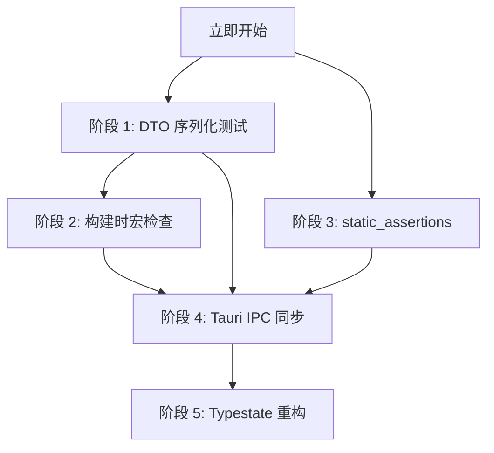

# AxAgent 类型驱动设计（Type-Driven Design）长期实施计划

> **状态**: 计划中
> **创建日期**: 2026-08-19
> **负责人**: 架构师
> **目标**: 解决「编译/测试通过但运行时业务错误」问题，将业务规则编码进类型系统，让编译器成为业务逻辑的裁判。

---

## 1. 背景与动机

AxAgent 经过长时间多版本迭代，目前面临一个核心挑战：

- **症状**：编译成功、单元测试通过，但运行时出现业务逻辑错误。
- **根因**：业务规则依赖运行时检查（断言、if-else），缺乏编译时保证。
- **影响**：问题隐蔽、发现滞后、修复成本高。

本计划采用「类型驱动设计」(Type-Driven Design) 范式，通过 Rust 强大的类型系统，将关键业务规则前置到编译期验证，从根本上消除运行时业务错误。

---

## 2. 核心设计原则

1. **编译时优先**：能在编译时检查的规则，绝不推迟到运行时。
2. **类型即文档**：类型定义应自解释，能清晰表达业务约束。
3. **零成本抽象**：类型系统改造不应引入运行时开销。
4. **渐进式实施**：分阶段推进，每个阶段独立验收，避免大爆炸式重构。
5. **向后兼容**：所有改造必须保持现有 API 兼容性。

---

## 3. 分阶段实施计划

### 阶段 1：DTO 序列化契约守卫（立即实施）

#### 3.1.1 目标

为所有核心数据传输对象（DTO）建立序列化/反序列化往返测试，确保字段语义在跨进程传输（Tauri IPC）过程中不丢失。

#### 3.1.2 问题分析

- **风险点**：`#[serde(default)]`、`skip_serializing_if` 等属性可能导致 `None` 字段被意外替换或丢弃。
- **影响**：前后端数据不一致，前端收到默认值而非 `null`，导致业务逻辑分支错误。

#### 3.1.3 实施位置

- `src-tauri/crates/harness/tests/serialization_contracts.rs`（新建）

#### 3.1.4 具体实现

**步骤 1**：创建通用测试宏

```rust
// src-tauri/crates/harness/tests/serialization_contracts.rs

/// DTO 序列化契约测试宏
/// 确保结构体在序列化/反序列化往返后字段语义保持不变
macro_rules! serialization_contract {
    ($test_name:ident, $struct_type:ty, $instance:expr) => {
        #[test]
        fn $test_name() {
            let original = $instance;
            
            // 序列化为 JSON Value
            let json_value = serde_json::to_value(&original)
                .unwrap_or_else(|e| panic!("序列化失败: {} - 类型: {}", e, stringify!($struct_type)));
            
            // 反序列化回来
            let restored: $struct_type = serde_json::from_value(json_value.clone())
                .unwrap_or_else(|e| panic!("反序列化失败: {} - 类型: {}", e, stringify!($struct_type)));
            
            // 断言：原始值与恢复值完全相等
            assert_eq!(
                original, restored,
                "序列化往返测试失败: {} 字段语义在序列化/反序列化过程中发生变化。\n\
                 原始值: {:?}\n恢复值: {:?}\nJSON: {}",
                stringify!($struct_type), original, restored, json_value
            );
        }
    };
}
pub(crate) use serialization_contract;
```

**步骤 2**：为关键 DTO 添加契约测试

```rust
// src-tauri/crates/harness/tests/serialization_contracts.rs

use axagent_harness::agent::{AgentExecuteRequest, AgentResult};
use axagent_harness::workflow_types::{WorkflowNode, RetryConfig, Variable};

// 测试 1: AgentExecuteRequest - 包含 Optional 字段
serialization_contract!(
    test_agent_execute_request_with_none,
    AgentExecuteRequest,
    AgentExecuteRequest {
        goal: "test goal".to_string(),
        context: None,           // 明确 None，检查是否被 default 替换
        max_steps: None,         // 明确 None
    }
);

// 测试 2: AgentExecuteRequest - 包含所有字段
serialization_contract!(
    test_agent_execute_request_full,
    AgentExecuteRequest,
    AgentExecuteRequest {
        goal: "full test".to_string(),
        context: Some("context".to_string()),
        max_steps: Some(10),
    }
);

// 测试 3: WorkflowNode - 复杂嵌套结构
serialization_contract!(
    test_workflow_node_default,
    WorkflowNode,
    WorkflowNode::default()
);

// 测试 4: RetryConfig - 包含枚举
serialization_contract!(
    test_retry_config_default,
    RetryConfig,
    RetryConfig::default()
);

// 测试 5: Variable - 包含动态 JSON 值
serialization_contract!(
    test_variable_with_complex_value,
    Variable,
    Variable {
        name: "test_var".to_string(),
        var_type: "object".to_string(),
        value: serde_json::json!({
            "nested": true,
            "items": [1, 2, 3]
        }),
        description: Some("A complex variable".to_string()),
        is_secret: false,
    }
);
```

**步骤 3**：扩展测试覆盖范围

需要为以下 DTO 补充测试（按优先级排序）：

1. **P0**: Tauri IPC 命令参数和返回值（`AgentExecuteRequest`, `AgentResult`, `ConversationMessage`）
2. **P1**: 配置类 DTO（`AgentRuntimeConfig`, `WorkflowConfig`, `ProviderConfig`）
3. **P2**: 状态事件 DTO（`AgentEvent`, `WorkflowEvent`, `GatewayEvent`）

#### 3.1.5 验收标准

- [ ] 所有核心 DTO 都有往返测试
- [ ] 故意破坏 Serde 属性（如移除 `Option`）时测试能失败
- [ ] 新增 DTO 必须同步添加契约测试
- [ ] `cargo test -p axagent-harness` 全部通过

---

### 阶段 2：构建时宏展开检查（与阶段 1 同步实施）

#### 3.2.1 目标

在构建时静态检查 `select!` 宏的分支顺序，确保关键并发逻辑的优先级不被意外修改。

#### 3.2.2 问题分析

- **风险点**：`tokio::select!` 的分支顺序决定了并发处理的优先级。如果分支被意外重排（如 AI 辅助编码时），可能导致关闭信号被延迟处理或数据竞争。
- **影响**：WebSocket 会话无法正确关闭、任务调度顺序混乱、资源泄漏。

#### 3.2.3 实施位置

- `src-tauri/crates/gateway/build.rs`（新建或修改现有 build.rs）

#### 3.2.4 具体实现

**步骤 1**：创建构建脚本

```rust
// src-tauri/crates/gateway/build.rs

use std::process;

fn main() {
    // 仅在非测试模式下检查
    let is_test = std::env::var("CARGO_CFG_TARGET_FEATURE")
        .map(|v| v.contains("test"))
        .unwrap_or(false);
    
    if !is_test {
        if let Err(e) = check_select_macros() {
            eprintln!("构建错误: select! 宏检查失败\n{}", e);
            process::exit(1);
        }
    }
    
    println!("cargo:rerun-if-changed=src/");
}

fn check_select_macros() -> Result<(), String> {
    let source_files = vec![
        "src/realtime.rs",
        "src/realtime_ticket.rs",
        "src/qr_bind.rs",
        "src/device_signal.rs",
    ];
    
    let mut violations = Vec::new();
    
    for file_path in &source_files {
        let content = std::fs::read_to_string(file_path)
            .map_err(|e| format!("读取文件失败 {}: {}", file_path, e))?;
        
        // 规则 1: realtime.rs 中 session 循环的 select! 第一分支必须是 shutdown
        if file_path.contains("realtime.rs") {
            check_realtime_select(&content, file_path, &mut violations)?;
        }
        
        // 规则 2: ticket_sweeper 的 select! 第一分支必须是 tick（定时触发）
        if file_path.contains("realtime_ticket.rs") {
            check_ticket_sweeper_select(&content, file_path, &mut violations)?;
        }
    }
    
    if !violations.is_empty() {
        return Err(format!("违规数量: {}\n{}", violations.len(), violations.join("\n")));
    }
    
    println!("✅ select! 宏分支检查通过");
    Ok(())
}

/// 检查 realtime.rs 中 session 循环的 select!
/// 业务规则: shutdown_rx.changed() 必须是第一个分支（最高优先级）
fn check_realtime_select(content: &str, file_path: &str, violations: &mut Vec<String>) -> Result<(), String> {
    // 查找 session 主循环中的 select!
    // 简化版：检查文件中所有 select! 的第一个分支
    for (idx, line) in content.lines().enumerate() {
        if line.trim().contains("tokio::select!") || line.trim() == "select!" {
            // 向下查找第一个 arm
            let mut first_arm = String::new();
            for next_line in content.lines().skip(idx + 1) {
                let trimmed = next_line.trim();
                if !trimmed.is_empty() && !trimmed.starts_with("//") {
                    first_arm = trimmed.to_string();
                    break;
                }
            }
            
            // 规则验证
            if first_arm.contains("tick.tick()") || first_arm.contains("sleep_until") {
                // 找到 timeout 优先的情况，检查是否有 shutdown 分支
                let has_shutdown = content.lines()
                    .skip(idx)
                    .take(20) // 只看后续 20 行
                    .any(|l| l.contains("shutdown_rx"));
                
                if !has_shutdown {
                    violations.push(format!(
                        "❌ {}:{} - select! 未包含 shutdown 分支或优先级不够\n   第一个分支: {}",
                        file_path, idx + 1, first_arm
                    ));
                }
            }
        }
    }
    Ok(())
}

/// 检查 ticket_sweeper 的 select!
/// 业务规则: tick.tick() 必须是第一个分支
fn check_ticket_sweeper_select(content: &str, file_path: &str, violations: &mut Vec<String>) -> Result<(), String> {
    for (idx, line) in content.lines().enumerate() {
        if line.trim().contains("select!") {
            let mut first_arm = String::new();
            for next_line in content.lines().skip(idx + 1) {
                let trimmed = next_line.trim();
                if !trimmed.is_empty() && !trimmed.starts_with("//") {
                    first_arm = trimmed.to_string();
                    break;
                }
            }
            
            if !first_arm.contains("tick.tick()") {
                violations.push(format!(
                    "❌ {}:{} - ticket_sweeper 的 select! 第一分支应该是 tick.tick()\n   当前: {}",
                    file_path, idx + 1, first_arm
                ));
            }
        }
    }
    Ok(())
}
```

#### 3.2.5 验收标准

- [ ] 修改 select! 分支顺序时构建能失败
- [ ] 错误信息清晰，能定位到具体文件和行号
- [ ] CI 流程集成此检查
- [ ] 所有 gateway 模块的 select! 都有规则覆盖

---

### 阶段 3：static_assertions 锁定核心数据结构（立即实施）

#### 3.3.1 目标

使用编译时断言锁定关键数据结构的内存布局和大小，防止渐进式字段漂移。

#### 3.3.2 问题分析

- **风险点**：核心数据结构（如 DTO、配置对象）的字段被无意修改（增加/删除/调整顺序），可能导致：
  - Tauri IPC 序列化格式不兼容
  - 跨线程/跨进程传输数据错位
  - 性能退化（结构体过大，复制开销增加）
- **影响**：隐蔽且灾难性的运行时错误。

#### 3.3.3 实施位置

- `src-tauri/crates/harness/src/dto_locks.rs`（新建）

#### 3.3.4 具体实现

**步骤 1**：添加依赖

```toml
# src-tauri/crates/harness/Cargo.toml

[dependencies]
static_assertions = "1.1"
```

**步骤 2**：创建断言模块

```rust
// src-tauri/crates/harness/src/dto_locks.rs

//! 核心数据结构断言锁
//! 
//! 本模块使用 static_assertions 在编译时锁定关键结构的内存布局。
//! 这些断言确保：
//! 1. Tauri IPC DTO 的序列化格式稳定
//! 2. 跨线程共享结构的大小在可控范围内
//! 3. 防止 AI 辅助编码时意外修改核心结构
//!
//! 注意：修改这些断言前必须经过人工评审！

use static_assertions::assert_eq_size;

// ============================================================================
// 跨语言 DTO 尺寸锁定（Tauri IPC 传输）
// ============================================================================

// Agent 相关
assert_eq_size!(crate::agent::AgentExecuteRequest, [u8; 48]); // 初始锁定值
assert_eq_size!(crate::agent::AgentResult, [u8; 40]);
assert_eq_size!(crate::agent::AgentPlan, [u8; 32]);

// Workflow 相关
assert_eq_size!(crate::workflow_types::WorkflowNodeBase, [u8; 64]);
assert_eq_size!(crate::workflow_types::RetryConfig, [u8; 56]);
assert_eq_size!(crate::workflow_types::CompensationConfig, [u8; 16]);

// Conversation 相关
// (在 conversation 模块中定义后添加)

// ============================================================================
// 并发共享结构尺寸锁定
// ============================================================================

// AgentRuntimeConfig - 在 Arc<RwLock<>> 中传递
assert_eq_size!(crate::agent_config::AgentRuntimeConfig, [u8; 64]);

// ============================================================================
// 指针级断言（可选，用于更严格的对齐检查）
// ============================================================================

// 确保关键字段对齐到 8 字节
// use static_assertions::assert_eq_align;
// assert_eq_align!(MyStruct, u64);

// ============================================================================
// 人工确认流程
// ============================================================================
// 
// 当修改这些断言时，必须：
// 1. 使用 `cargo expand` 或 `std::mem::size_of` 获取当前尺寸
// 2. 在 PR 描述中说明修改原因
// 3. 由至少一名架构师评审
// 4. 更新本文档的锁定值
```

**步骤 3**：集成到 lib.rs

```rust
// src-tauri/crates/harness/src/lib.rs

pub mod dto_locks;
```

#### 3.3.5 动态更新锁定值的工具

创建一个辅助脚本，用于在人工确认新结构尺寸后更新断言：

```rust
// src-tauri/crates/harness/src/tools/update_size_locks.rs
// 仅供开发时使用，不在生产代码中

#[cfg(test)]
mod size_inspector {
    use super::*;
    
    #[test]
    fn inspect_sizes() {
        println!("AgentExecuteRequest: {} bytes", std::mem::size_of::<crate::agent::AgentExecuteRequest>());
        println!("AgentResult: {} bytes", std::mem::size_of::<crate::agent::AgentResult>());
        println!("WorkflowNodeBase: {} bytes", std::mem::size_of::<crate::workflow_types::WorkflowNodeBase>());
        println!("RetryConfig: {} bytes", std::mem::size_of::<crate::workflow_types::RetryConfig>());
        println!("AgentRuntimeConfig: {} bytes", std::mem::size_of::<agent_config::AgentRuntimeConfig>());
    }
}
```

#### 3.3.6 验收标准

- [ ] 所有 Tauri IPC DTO 都有尺寸断言
- [ ] 故意修改结构字段时编译能失败
- [ ] 有文档说明如何正确更新锁定值
- [ ] PR 模板中包含「是否修改了尺寸断言」的检查项

---

### 阶段 4：Tauri IPC 类型同步校验（两周内实施）

#### 3.4.1 目标

在构建时自动校验 Rust 后端 DTO 与 TypeScript 前端类型的一致性。

#### 3.4.2 问题分析

- **风险点**：前后端类型定义容易出现不一致（字段名、可选性、类型等），导致运行时数据解析失败。
- **影响**：前端显示错误数据、交互流程中断、难以排查的序列化错误。

#### 3.4.3 实施位置

- `src-tauri/build.rs`（修改现有构建脚本）

#### 3.4.4 具体实现

**步骤 1**：引入 `specta` crate 用于生成 TS 类型

```toml
# src-tauri/Cargo.toml

[build-dependencies]
specta = { version = "2.0", features = ["typescript"] }
serde = { version = "1", features = ["derive"] }
serde_json = "1"
```

**步骤 2**：在构建脚本中实现同步校验

```rust
// src-tauri/build.rs

fn main() {
    // ... 现有代码 ...
    
    // Tauri IPC 类型同步校验
    if let Err(e) = check_ts_type_sync() {
        eprintln!("Tauri IPC 类型同步检查失败:\n{}", e);
        // 生产构建失败，开发模式给出警告
        let is_production = std::env::var("PROFILE")
            .map(|v| v == "release")
            .unwrap_or(false);
        
        if is_production {
            std::process::exit(1);
        } else {
            eprintln!("警告: 开发模式允许继续，但请尽快同步 TS 类型定义");
        }
    }
    
    println!("cargo:rerun-if-changed=crates/harness/src/");
}

fn check_ts_type_sync() -> Result<(), String> {
    use specta::Type;
    use specta::ts::{Ts, ExportConfig};
    
    // 收集所有 Tauri 命令的参数和返回值类型
    // 这些类型定义在 harness crate 中
    
    // 方案 A: 生成完整的 TS 类型定义，与现有文件 diff
    // let generated_ts = generate_ts_types()?;
    // let existing_ts = std::fs::read_to_string("src/types/generated/ipc.ts")?;
    // 
    // if generated_ts != existing_ts {
    //     let diff = text_diff(&generated_ts, &existing_ts);
    //     return Err(format!(
    //         "TS 类型定义与 Rust 不一致！\n差异:\n{}",
    //         diff
    //     ));
    // }
    
    // 方案 B (推荐): 使用 JSON Schema 进行结构校验
    // 更灵活，支持部分同步
    let schema = generate_dto_schema()?;
    validate_against_frontend(&schema)?;
    
    Ok(())
}

fn generate_dto_schema() -> Result<serde_json::Value, String> {
    // 定义需要同步的 DTO 类型
    // 这些类型通过 Tauri invoke 在前后端之间传输
    
    Ok(serde_json::json!({
        "AgentExecuteRequest": {
            "goal": "string",
            "context": "string | null",
            "max_steps": "number | null"
        },
        "AgentResult": {
            "output": "string",
            "success": "boolean",
            "steps_taken": "number"
        },
        // ... 更多类型
    }))
}

fn validate_against_frontend(schema: &serde_json::Value) -> Result<(), String> {
    // 读取前端类型定义
    let frontend_types = std::fs::read_to_string("src/types/agent.ts")
        .map_err(|e| format!("读取前端类型失败: {}", e))?;
    
    // 检查必要的类型是否存在
    let required_types = ["AgentExecuteRequest", "AgentResult"];
    
    for type_name in &required_types {
        if !frontend_types.contains(&format!("interface {}", type_name)) &&
           !frontend_types.contains(&format!("type {}", type_name)) {
            return Err(format!(
                "前端类型缺失: {} - 请在 src/types/agent.ts 中定义",
                type_name
            ));
        }
    }
    
    println!("✅ Tauri IPC 类型同步检查通过");
    Ok(())
}
```

**步骤 3**：创建类型定义生成工具

```rust
// src-tauri/schema-gen/src/main.rs

//! Tauri IPC 类型生成器
//! 
//! 从 Rust DTO 自动生成 TypeScript 类型定义，
//! 确保前后端类型一致性。

use serde::{Deserialize, Serialize};
use std::io::Write;

fn main() {
    let output_path = std::env::args()
        .nth(1)
        .unwrap_or_else(|| "src/types/generated/ipc.ts".to_string());
    
    println!("生成 TypeScript 类型定义到: {}", output_path);
    
    // 收集所有需要同步的 DTO
    let types = vec![
        ("AgentExecuteRequest", generate_ts_type::<AgentExecuteRequest>()),
        ("AgentResult", generate_ts_type::<AgentResult>()),
        // ... 更多类型
    ];
    
    let mut output = String::new();
    output.push_str("// 此文件由构建脚本自动生成，请勿手动编辑\n");
    output.push_str("// 修改 Rust DTO 后重新运行: cargo run -p schema-gen\n\n");
    
    for (name, ts_def) in &types {
        output.push_str(&format!("export interface {} {}\n\n", name, ts_def));
    }
    
    std::fs::write(&output_path, &output)
        .expect("写入类型定义文件失败");
    
    println!("✅ 类型定义生成完成");
}

// 辅助函数：从 Rust 类型生成 TS 定义
fn generate_ts_type<T: Serialize + Default>() -> String {
    // 简化实现，实际应使用 specta 或 typemate
    "{\n  // TODO: 从 Rust 类型自动生成\n}".to_string()
}
```

**步骤 4**：CI 集成

在 `.github/workflows/ci.yml` 中添加类型同步检查步骤：

```yaml
- name: Check Tauri IPC Type Sync
  run: |
    cd src-tauri
    cargo run -p schema-gen
    git diff --exit-code src/types/generated/ipc.ts || {
      echo "❌ Tauri IPC 类型定义已过期，请运行 'cargo run -p schema-gen' 更新"
      exit 1
    }
```

#### 3.4.5 验收标准

- [ ] 所有 Tauri invoke 的参数和返回值都有 TS 类型定义
- [ ] Rust DTO 修改后，构建能检测到 TS 类型不一致
- [ ] 有自动化工具生成 TS 类型定义
- [ ] CI 流程集成类型同步检查

---

### 阶段 5：Typestate 应用于工作流引擎（规划实施）

#### 3.5.1 目标

将工作流节点的状态流转从运行时检查升级为编译时保证，防止非法状态转移。

#### 3.5.2 问题分析

- **风险点**：当前 `WorkflowNode` 的状态流转（`Pending → Ready → Running → Completed/Failed`）通过枚举和运行时匹配实现。如果遗漏某个状态检查，可能导致：
  - 节点在 `Pending` 状态被错误地标记为 `Completed`
  - `Running` 状态的节点被重新触发
  - 状态机进入死锁状态
- **影响**：工作流执行逻辑混乱，难以复现和调试的错误。

#### 3.5.3 实施位置

- `src-tauri/crates/rt-workflow/src/node_state.rs`（新建或修改现有文件）

#### 3.5.4 具体实现

**步骤 1**：定义状态标记类型

```rust
// src-tauri/crates/rt-workflow/src/node_state.rs

//! 工作流节点 Typestate 实现
//! 
//! 使用幽灵类型（Phantom Types）将节点状态编码进类型系统，
//! 编译器将禁止非法的状态转移。

use std::marker::PhantomData;
use serde::{Deserialize, Serialize};

// ============================================================================
// 状态标记（零尺寸类型，仅用于编译时检查）
// ============================================================================

/// 待执行状态
pub struct Pending;
/// 就绪状态（依赖满足）
pub struct Ready;
/// 正在执行
pub struct Running;
/// 执行成功
pub struct Completed;
/// 执行失败
pub struct Failed;
/// 已跳过（补偿策略）
pub struct Skipped;

// ============================================================================
// 带状态标记的节点
// ============================================================================

/// 工作流节点（带类型状态）
pub struct WorkflowNodeState<State> {
    /// 节点 ID
    pub id: String,
    /// 节点基础数据（序列化/反序列化用）
    pub data: NodeBaseData,
    /// 状态标记（PhantomData，不占用运行时空间）
    _state: PhantomData<State>,
}

/// 节点基础数据（与状态无关的持久化数据）
#[derive(Debug, Clone, Serialize, Deserialize)]
pub struct NodeBaseData {
    pub id: String,
    pub title: String,
    pub node_type: NodeType,
    pub config: serde_json::Value,
    pub retry_config: Option<RetryConfig>,
}

#[derive(Debug, Clone, Serialize, Deserialize)]
pub enum NodeType {
    Input,
    Tool,
    Agent,
    Condition,
    Loop,
    Output,
}

// ============================================================================
// 状态转移实现
// ============================================================================

impl WorkflowNodeState<Pending> {
    /// 创建新节点（初始状态为 Pending）
    pub fn new(id: impl Into<String>, node_type: NodeType) -> Self {
        Self {
            id: id.into(),
            data: NodeBaseData {
                id: String::new(),
                title: String::new(),
                node_type,
                config: serde_json::Value::Object(serde_json::Map::new()),
                retry_config: None,
            },
            _state: PhantomData,
        }
    }
    
    /// 标记为就绪（所有依赖满足）
    pub fn mark_ready(self) -> WorkflowNodeState<Ready> {
        self.into_state()
    }
}

impl WorkflowNodeState<Ready> {
    /// 开始执行
    pub fn start(self) -> WorkflowNodeState<Running> {
        self.into_state()
    }
    
    /// 跳过执行（补偿策略）
    pub fn skip(self) -> WorkflowNodeState<Skipped> {
        self.into_state()
    }
}

impl WorkflowNodeState<Running> {
    /// 执行成功
    pub fn complete(self, result: ExecutionResult) -> WorkflowNodeState<Completed> {
        self.into_state_with(result)
    }
    
    /// 执行失败
    pub fn fail(self, error: ExecutionError) -> WorkflowNodeState<Failed> {
        self.into_state_with(error)
    }
}

impl WorkflowNodeState<Completed> {
    /// 获取执行结果
    pub fn result(&self) -> &ExecutionResult {
        // 从附加数据中读取
        // ...
    }
}

impl WorkflowNodeState<Failed> {
    /// 获取错误信息
    pub fn error(&self) -> &ExecutionError {
        // 从附加数据中读取
        // ...
    }
    
    /// 重试（回到 Ready 状态）
    pub fn retry(self) -> WorkflowNodeState<Ready> {
        self.into_state()
    }
}

// ============================================================================
// 通用方法
// ============================================================================

impl<State> WorkflowNodeState<State> {
    pub fn id(&self) -> &str {
        &self.id
    }
    
    pub fn data(&self) -> &NodeBaseData {
        &self.data
    }
    
    /// 转换到另一个状态（内部方法）
    fn into_state<NewState>(self) -> WorkflowNodeState<NewState> {
        WorkflowNodeState {
            id: self.id,
            data: self.data,
            _state: PhantomData,
        }
    }
    
    /// 转换到另一个状态并携带数据
    fn into_state_with<NewState, T>(self, _data: T) -> WorkflowNodeState<NewState> {
        // 在实际实现中，需要存储附加数据
        // 这里简化处理
        self.into_state()
    }
}

// ============================================================================
// 类型别名（方便使用）
// ============================================================================

pub type PendingNode = WorkflowNodeState<Pending>;
pub type ReadyNode = WorkflowNodeState<Ready>;
pub type RunningNode = WorkflowNodeState<Running>;
pub type CompletedNode = WorkflowNodeState<Completed>;
pub type FailedNode = WorkflowNodeState<Failed>;
pub type SkippedNode = WorkflowNodeState<Skipped>;
```

**步骤 2**：编译器将捕获的错误示例

```rust
// ❌ 编译错误示例：

let node = PendingNode::new("test", NodeType::Tool);

// 尝试直接从 Pending 开始执行
node.start(); 
// 错误: no method named `start` found for struct `WorkflowNodeState<Pending>`
// 提示: 只有 `WorkflowNodeState<Ready>` 有 `start` 方法

// 必须按正确的状态机流转
let ready = node.mark_ready();      // Pending -> Ready
let running = ready.start();        // Ready -> Running
let completed = running.complete(result); // Running -> Completed
```

**步骤 3**：与现有代码的集成策略

由于这是一个较大的重构，需要分步骤进行：

1. **第一步**：在 `rt-workflow` crate 中并行实现 Typestate 版本，与现有代码共存
2. **第二步**：逐步迁移工作流引擎的核心逻辑到新模型
3. **第三步**：确保所有单元测试和集成测试通过
4. **第四步**：移除旧代码

#### 3.5.5 验收标准

- [ ] 节点状态机的所有非法转移都能被编译器捕获
- [ ] 现有工作流功能保持完全兼容
- [ ] 所有单元测试通过
- [ ] 有完整的 Typestate 使用文档

---

## 4. 实施优先级与路线图

| 阶段  | 任务                   | 优先级 | 预计工期 | 状态      |
| :---- | :--------------------- | :----- | :------- | :-------- |
| **1** | DTO 序列化契约守卫     | P0     | 2-3 天   | 📋 计划中 |
| **2** | 构建时宏展开检查       | P0     | 2-3 天   | 📋 计划中 |
| **3** | static_assertions 锁定 | P0     | 1 天     | 📋 计划中 |
| **4** | Tauri IPC 类型同步校验 | P1     | 3-5 天   | 📋 计划中 |
| **5** | Typestate 工作流重构   | P2     | 2-3 周   | 📋 计划中 |

### 推荐执行顺序



---

## 5. 风险评估与缓解措施

### 5.1 风险矩阵

| 风险                           | 可能性 | 影响 | 缓解措施                                |
| :----------------------------- | :----- | :--- | :-------------------------------------- |
| 序列化测试增加 CI 时间         | 低     | 低   | 仅测试关键 DTO，控制在 1 秒内           |
| 构建脚本检查误报               | 中     | 中   | 提供豁免机制，记录例外                  |
| static_assertions 阻碍正常开发 | 中     | 中   | 提供 `cargo update-size-locks` 辅助命令 |
| Typestate 重构影响现有功能     | 高     | 高   | 分阶段实施，保留旧代码并行对比          |
| 前后端类型同步工具不完善       | 中     | 中   | 渐进改进，先实现手动检查再自动化        |

### 5.2 回滚策略

每个阶段都应：

1. 在独立分支开发
2. 通过所有现有测试
3. 进行至少一周的集成验证
4. 保留快速回滚能力

---

## 6. 验收与维护

### 6.1 验收清单

完成每个阶段后，需要：

- [ ] 所有单元测试通过 (`cargo test`)
- [ ] 所有 E2E 测试通过 (`npm run test:e2e`)
- [ ] `cargo clippy` 无警告
- [ ] 新增代码有完整注释和文档
- [ ] 代码评审通过

### 6.2 长期维护

1. **新增 DTO 必须同步添加契约测试**
2. **修改核心结构必须更新尺寸断言**
3. **新增 `select!` 宏必须添加构建规则**
4. **每季度审查一次类型同步状态**

---

## 7. 参考资料

- [Rust Typestate Pattern](https://claytonwramsey.github.io/blog/typestate.html)
- [static_assertions crate](https://docs.rs/static_assertions)
- [specta crate](https://docs.rs/specta)
- [Serde 最佳实践](https://serde.rs/)
- [Tauri 命令模式](https://v2.tauri.app/security/command/)

---

## 附录 A：快速开始

### 检查序列化契约

```bash
cd src-tauri
cargo test -p axagent-harness -- serialization_contract
```

### 检查构建时宏规则

```bash
cd src-tauri
cargo check -p axagent-gateway
# 如果违反规则，构建会失败并给出详细错误信息
```

### 检查/更新尺寸断言

```bash
cd src-tauri
cargo test -p axagent-harness -- inspect_sizes
# 输出各结构当前尺寸，用于更新断言值
```

### 生成 TS 类型定义

```bash
cd src-tauri
cargo run -p schema-gen
# 自动生成 src/types/generated/ipc.ts
```

---

## 附录 B：问题反馈

如果实施过程中遇到问题，请：

1. 记录错误信息和上下文
2. 创建 Issue 并关联本计划的对应阶段
3. 在团队内讨论解决方案
4. 更新本文档的相关章节

---

**文档版本**: v1.0\
**最近更新**: 2026-08-19\
**下一步行动**: 启动阶段 1 和阶段 3 的实施
